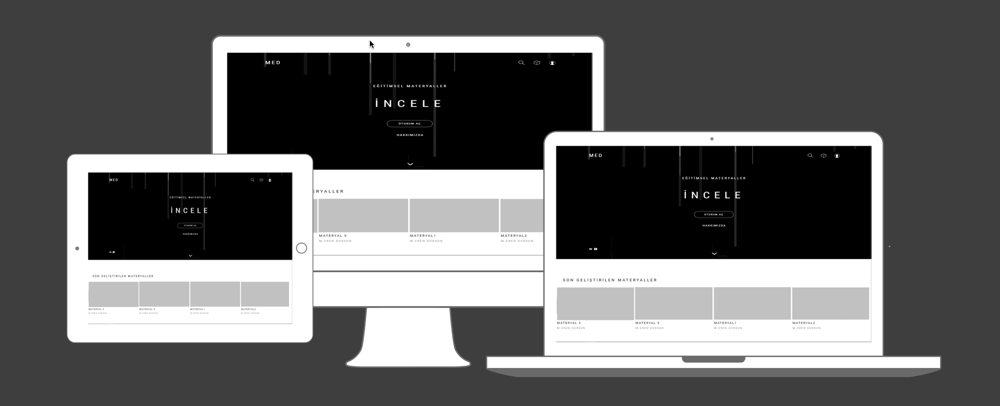
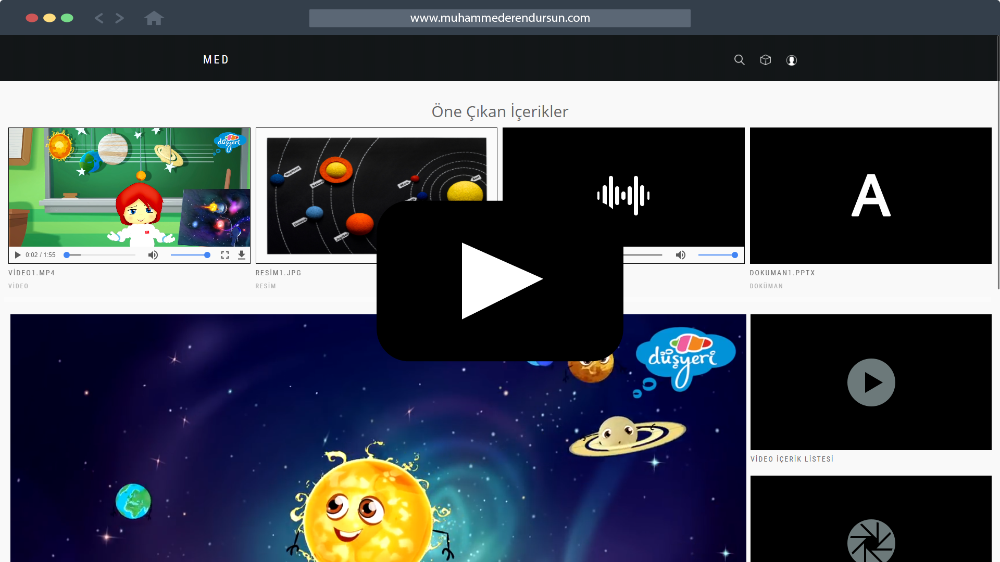

# MED Materyal Paylaşım Platformu

####  Geliştirici
- Muhammed Eren DURSUN
- Bilgisayar ve Öğretim Teknolojileri Eğitimi

####  Proje Tanıtım
- Materials for Educational Design – Eğitimsel Tasarım için Materyaller
- MED Materyal Paylaşım Platformu
- İncele,Geliştir ve Yayınla
- PHP, MySQL

####  Projenin Amacı
- Fatih Projesi yazılım alt yapısına destek sağlamak,
- EBA'nın kısıtlı bir erişim sağladığı,
- Eğitimciler ve Öğrenciler arasında köprü oluşturmak,
- Eğitimciler arasında içerik paylaşımı yapmaları,
- Eğitimsel içerikleri materyal haline getirmek,
   için geliştirildi.

# Galeri

# Video

